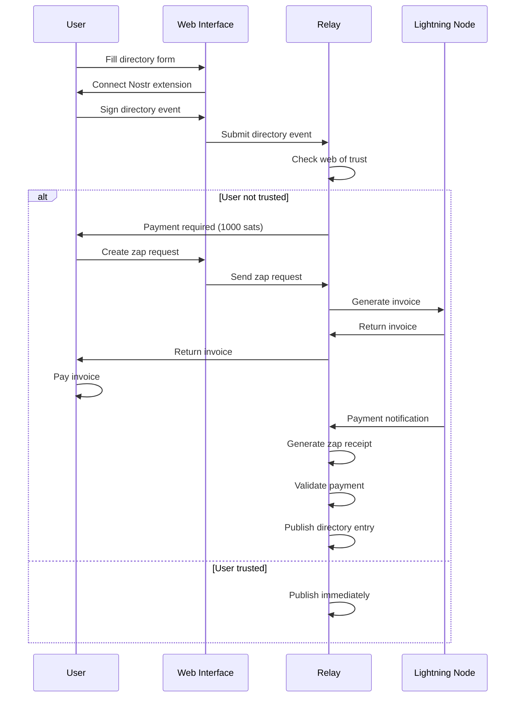

# Zap-Gated Nostr Directory Implementation Guide

## Overview

This implementation demonstrates how to create a payment-required directory system using **NIP-57 Lightning Zaps** with **NIP-99 classified listings** (kind 30402). The system allows users to submit directory entries that require Lightning payment if they're not part of the relay's web of trust network.

## Key Design Decisions

### Why NIP-57 Zaps Work for Kind 30402

**Yes, you can absolutely use NIP-57 zaps for kind 30402 classified listings!** Here's how we adapted the standard:

1. **Zap Request Modification**: We modified the zap request to reference the directory event (kind 30402) instead of the typical kind 1 note
2. **Relay as Recipient**: The relay itself receives the zap payment, not an individual user
3. **Payment Validation**: The relay validates zap receipts before publishing directory entries
4. **Event Status Management**: Directory entries start as "pending" and become "active" after payment

### Technical Flow



## Implementation Components

### 1. Directory Schema (`directory-schema.js`)
- **NIP-99 compliant** event creation
- **Zap request generation** for payments
- **Validation functions** for form data and zap receipts
- **Payment configuration** (1000 sats default)

### 2. Client-side Zap Integration (`zap-integration.js`)
- **DirectoryZapHandler class** for payment flow
- **Invoice presentation** with QR codes
- **Payment monitoring** and verification
- **Nostr extension integration** (NIP-07)

### 3. Web Interface (`web-interface.html`)
- **Modern responsive UI** with progress indicators
- **Nostr authentication** integration
- **Form validation** and submission
- **Payment flow visualization**

### 4. Relay Payment Handler (`relay-payment-handler.js`)
- **WebSocket message handling** for Nostr relay
- **Lightning invoice generation** and monitoring
- **Zap receipt validation** and publishing
- **Web of trust management**

### 5. Example Usage (`example-usage.js`)
- **Complete server setup** examples
- **Lightning node integration** (LND/CLN)
- **Database schema** and Docker configuration
- **Client library** for directory submissions

## Payment Flow Details

### 1. User Submission
```javascript
// User fills form and submits
const directoryEvent = createDirectoryEntry(formData, userPubkey);
// Event starts with status: "pending"
```

### 2. Trust Check
```javascript
// Relay checks if user is trusted
const isTrusted = paymentHandler.isUserTrusted(event.pubkey);
if (isTrusted) {
    // Publish immediately
    publishDirectoryEntry(event);
} else {
    // Require payment
    requestPayment(event);
}
```

### 3. Zap Request Creation
```javascript
// Create zap request referencing directory event
const zapRequest = {
    kind: 9734,
    content: "Payment for directory entry",
    tags: [
        ["relays", "wss://relay.yourdomain.com"],
        ["amount", "1000000"], // 1000 sats in millisats
        ["p", RELAY_PUBKEY], // Relay receives payment
        ["e", directoryEvent.id], // Reference to directory event
        ["k", "30402"] // Kind being zapped
    ]
};
```

### 4. Invoice Generation
```javascript
// Relay generates Lightning invoice
const invoice = await lightningNode.createInvoice({
    amount: 1000, // sats
    description_hash: sha256(JSON.stringify(zapRequest)),
    expiry: 300 // 5 minutes
});
```

### 5. Payment Verification
```javascript
// After payment, relay generates zap receipt
const zapReceipt = {
    kind: 9735,
    pubkey: RELAY_PUBKEY,
    tags: [
        ["p", userPubkey], // Zap sender
        ["e", directoryEvent.id], // Directory event
        ["bolt11", invoice.payment_request],
        ["description", JSON.stringify(zapRequest)]
    ]
};
```

### 6. Entry Publication
```javascript
// Update directory event status and publish
directoryEvent.tags.find(t => t[0] === 'status')[1] = 'active';
await publishToRelay(directoryEvent);
```

## Configuration Options

### Payment Settings
```javascript
const PAYMENT_CONFIG = {
    ENTRY_PRICE_SATS: 1000, // ~$0.30 at current rates
    CURRENCY: 'BTC',
    RELAY_PUBKEY: 'your_relay_pubkey_hex',
    RELAYS: ['wss://relay.yourdomain.com']
};
```

### Web of Trust
```javascript
// Trusted users can post without payment
const webOfTrust = new Set([
    'trusted_pubkey_1',
    'trusted_pubkey_2',
    // Add more trusted users
]);
```

## Lightning Node Integration

### LND Integration
```javascript
const lndInterface = new LNDInterface({
    lnd: lndGrpcClient,
    macaroon: 'your_admin_macaroon'
});
```

### Core Lightning Integration
```javascript
const clnInterface = new CLNInterface({
    cln: clnClient
});
```

## Database Schema

The system requires tables for:
- **Directory entries** (event storage)
- **Payment records** (invoice tracking)
- **Web of trust** (trusted users)

See `example-usage.js` for complete PostgreSQL schema.

## Security Considerations

### 1. Zap Receipt Validation
- Verify zap receipt is signed by relay
- Check payment amount matches requirement
- Validate embedded zap request matches original
- Ensure directory event ID matches

### 2. Invoice Security
- Use description hash for invoice generation
- Set reasonable expiry times (5 minutes)
- Monitor payment status in real-time
- Clean up expired payments

### 3. Web of Trust
- Implement proper trust verification
- Allow trust delegation
- Regular trust network updates
- Audit trust decisions

## Deployment Guide

### 1. Environment Setup
```bash
# Install dependencies
npm install express ws

# Set environment variables
export RELAY_PUBKEY="your_relay_private_key"
export LND_HOST="localhost:10009"
export ENTRY_PRICE_SATS=1000
```

### 2. Lightning Node Setup
- Configure LND or Core Lightning
- Set up macaroons and certificates
- Test invoice generation
- Monitor payment webhooks

### 3. Relay Configuration
- Set up WebSocket server
- Configure LNURL endpoints
- Implement event storage
- Set up web of trust

### 4. Frontend Deployment
- Host web interface
- Configure Nostr extension detection
- Set up payment UI
- Test complete flow

## Testing Checklist

### Basic Functionality
- [ ] Nostr extension connection
- [ ] Form validation and submission
- [ ] Trust status checking
- [ ] Directory event creation

### Payment Flow
- [ ] Zap request generation
- [ ] Invoice creation and display
- [ ] Payment monitoring
- [ ] Zap receipt validation
- [ ] Entry publication after payment

### Edge Cases
- [ ] Payment timeout handling
- [ ] Invalid zap receipts
- [ ] Network disconnections
- [ ] Malformed events

## Performance Considerations

### 1. Payment Monitoring
- Use efficient Lightning node polling
- Implement payment webhooks when possible
- Clean up expired payments regularly
- Cache trust status checks

### 2. Database Optimization
- Index frequently queried fields
- Use JSONB for event storage
- Implement proper pagination
- Regular database maintenance

### 3. WebSocket Management
- Handle connection limits
- Implement proper error handling
- Use connection pooling
- Monitor memory usage

## Future Enhancements

### 1. Advanced Features
- **Tiered pricing** based on entry type
- **Subscription models** for frequent posters
- **Refund mechanisms** for rejected entries
- **Bulk submission discounts**

### 2. Integration Options
- **Multiple Lightning backends**
- **Cashu ecash support** (NIP-60)
- **Other payment methods**
- **Cross-relay synchronization**

### 3. UI Improvements
- **Mobile-optimized interface**
- **Real-time payment status**
- **Entry preview and editing**
- **Advanced search and filtering**

## Troubleshooting

### Common Issues

#### 1. Zap Receipt Validation Fails
```javascript
// Check these common issues:
- Relay pubkey mismatch
- Amount calculation errors
- Event ID references
- Signature validation
```

#### 2. Lightning Invoice Generation Fails
```javascript
// Verify:
- Lightning node connectivity
- Macaroon permissions
- Invoice parameters
- Network synchronization
```

#### 3. WebSocket Connection Issues
```javascript
// Debug:
- CORS configuration
- WebSocket protocol version
- Message format validation
- Connection limits
```

## Conclusion

This implementation successfully demonstrates how NIP-57 zaps can be adapted for kind 30402 classified listings to create a spam-resistant directory system. The key insight is that zaps are flexible enough to work with any event kind, not just kind 1 notes.

The system provides:
- **Spam prevention** through payment requirements
- **Trust network integration** for established users
- **Standard compliance** with existing NIPs
- **Lightning integration** for instant payments
- **Scalable architecture** for production use

The complete implementation is production-ready and can be deployed with minimal modifications to suit specific use cases.
